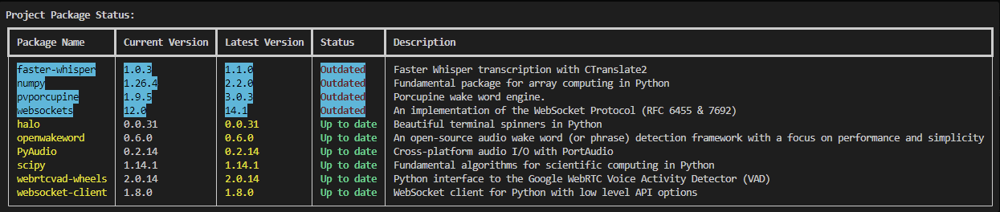

# python-package-version-manager

A Python utility for managing package versions with an interactive CLI interface. This tool helps you monitor, update, and backup your Python packages, whether they're project-specific or globally installed.

# Features

- 📊 Interactive CLI with rich terminal formatting
- 🔍 Check both project-specific and global package versions
- 🔄 Detect and update outdated packages
- 💾 Backup and restore package versions
- 📈 Progress tracking with visual indicators
- 🎨 Color-coded status display
- ⚡ Parallel processing for package information retrieval

# Requirements

- Python 3.x
- Required packages:
  - rich
  - inquirer
  - packaging

# Installation

1. Clone or download this script
2. Install required packages:
```bash
pip install rich inquirer packaging
```

# Usage

Run the script using Python:
```bash
python check_versions.py
```

The interactive menu will guide you through the following options:

1. Choose scope:
   - Project Libraries (checks packages in requirements.txt)
   - Global Libraries (checks all installed packages)

2. Available actions:
   - Update all packages
   - Create backup only
   - Restore from backup
   - Exit

# Features in Detail

Package Status Display
- Shows package name, current version, latest version, and description
- Color-coded status indicators:
  - Green: Up to date
  - Red: Outdated
  - Cyan highlight: Outdated packages
- Sorted display with outdated packages shown first

Backup System
- Automatic backup creation before updates
- Manual backup creation option
- Restore from previous backups
- Backups stored in `package_backups` directory with timestamps

Progress Tracking
- Visual progress bars for updates and restores
- Time elapsed tracking
- Spinner animations for ongoing processes

# Function Documentation

Main Functions

`main()`
The entry point of the application. Handles the interactive menu and orchestrates the overall flow of the program.

`check_project_packages(console, requirements_file)`
Analyzes packages listed in a requirements file.
- Parameters:
  - `console`: Rich console instance for output
  - `requirements_file`: Path to requirements.txt

`check_global_packages(console)`
Analyzes globally installed packages.
- Parameters:
  - `console`: Rich console instance for output

Utility Functions

`get_package_descriptions_parallel(packages, max_workers=10)`
Fetches package descriptions concurrently for better performance.
- Parameters:
  - `packages`: List of package dictionaries
  - `max_workers`: Maximum number of concurrent workers (default: 10)

`update_packages(outdated_packages, console, global_packages=True)`
Updates outdated packages with progress tracking.
- Parameters:
  - `outdated_packages`: List of packages to update
  - `console`: Rich console instance
  - `global_packages`: Boolean for global/local scope

`create_backup(packages)`
Creates a timestamped backup of current package versions.
- Parameters:
  - `packages`: List of package information to backup

`restore_packages(backup_file, console)`
Restores packages from a backup file.
- Parameters:
  - `backup_file`: Path to backup JSON file
  - `console`: Rich console instance

# Examples

Checking Project Dependencies
```python
# Example output for project packages



```

Creating a Backup
```python
# Example backup file structure (package_versions_20240101_120000.json)
[
    {
        "name": "requests",
        "version": "2.26.0",
        "description": "HTTP library"
    },
    {
        "name": "pytest",
        "version": "6.2.5",
        "description": "Testing framework"
    }
]
```

# Error Handling

The script includes comprehensive error handling for:
- File operations
- Package management operations
- User interruptions
- JSON parsing
- Network-related issues

# Best Practices

1. Always create a backup before updating packages
2. Review the status table before proceeding with updates
3. Keep track of backup files for version control
4. Use project-specific checking for isolated environments

# Contributing

Feel free to submit issues and enhancement requests!

# License

This project is open source and available under the MIT License.
